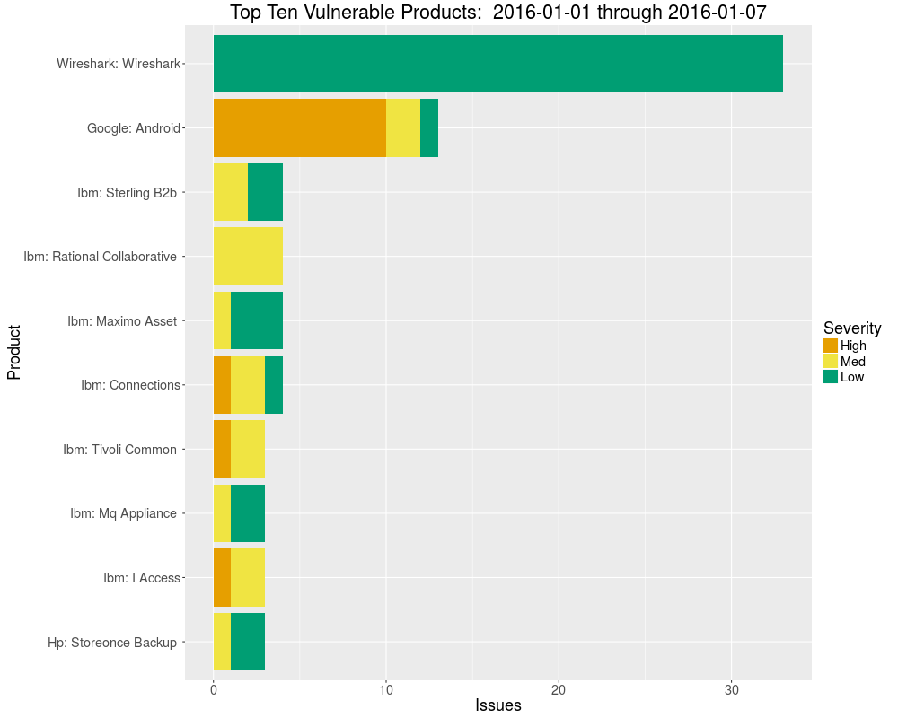

This is an R script to list and plot recent computer security vulnerabilities 
available from [US CERT](https://www.us-cert.gov/).

## Example output

Here is some example plots:

And tables:

|Vendor             | Total_Issues|
|:------------------|------------:|
|Ibm                |           48|
|Wireshark          |           33|
|Google             |           13|
|Hp                 |            8|
|Cisco              |            3|
|Eucalyptus         |            2|
|Mozilla            |            2|
|Apache             |            1|
|Dx Library Project |            1|
|Ipswitch           |            1|

|Product                      | Total_Issues|
|:----------------------------|------------:|
|Wireshark: Wireshark         |           33|
|Google: Android              |           13|
|Ibm: Connections             |            4|
|Ibm: Maximo Asset            |            4|
|Ibm: Rational Collaborative  |            4|
|Ibm: Sterling B2b Integrator |            4|
|Hp: Storeonce Backup         |            3|
|Ibm: I Access                |            3|
|Ibm: Mq Appliance            |            3|
|Ibm: Tivoli Common           |            3|

|    |Product                      |Severity | Score|Info          |
|:---|:----------------------------|:--------|-----:|:-------------|
|1   |Google: Android              |High     |  10.0|CVE-2015-6636 |
|2   |Google: Android              |High     |   9.3|CVE-2015-6637 |
|3   |Google: Android              |High     |   9.3|CVE-2015-6638 |
|4   |Google: Android              |High     |   9.3|CVE-2015-6639 |
|5   |Google: Android              |High     |   9.3|CVE-2015-6640 |
|6   |Google: Android              |High     |   7.8|CVE-2015-6642 |
|7   |Google: Android              |High     |   7.2|CVE-2015-6643 |
|8   |Google: Android              |High     |   7.1|CVE-2015-6645 |
|9   |Google: Android              |High     |   7.8|CVE-2015-6646 |
|10  |Google: Android              |High     |   9.3|CVE-2015-6647 |
|13  |Ibm: I Access                |High     |   7.2|CVE-2015-2023 |
|16  |Ibm: Connections             |High     |   7.8|CVE-2015-5038 |
|18  |Ibm: Tivoli Common           |High     |  10.0|CVE-2015-7450 |
|28  |Google: Android              |Med      |   4.3|CVE-2015-6644 |
|30  |Hp: Storeonce Backup         |Med      |   6.8|CVE-2015-5445 |
|31  |Hp: Storeonce Backup         |Med      |   5.8|CVE-2015-5446 |
|41  |Ibm: Connections             |Med      |   6.8|CVE-2015-5037 |
|43  |Ibm: Maximo Asset            |Med      |   4.0|CVE-2015-5051 |
|44  |Ibm: Maximo Asset            |Med      |   5.5|CVE-2015-7396 |
|47  |Ibm: Sterling B2b Integrator |Med      |   5.8|CVE-2015-7410 |
|48  |Ibm: Mq Appliance            |Med      |   5.0|CVE-2015-7420 |
|49  |Ibm: Mq Appliance            |Med      |   5.0|CVE-2015-7421 |
|51  |Ibm: Sterling B2b Integrator |Med      |   4.3|CVE-2015-7431 |
|53  |Ibm: Maximo Asset            |Med      |   4.0|CVE-2015-7452 |
|57  |Wireshark: Wireshark         |Med      |   4.3|CVE-2015-3182 |
|58  |Wireshark: Wireshark         |Med      |   4.3|CVE-2015-8711 |
|59  |Wireshark: Wireshark         |Med      |   4.3|CVE-2015-8712 |
|60  |Wireshark: Wireshark         |Med      |   4.3|CVE-2015-8713 |
|61  |Wireshark: Wireshark         |Med      |   4.3|CVE-2015-8714 |
|62  |Wireshark: Wireshark         |Med      |   4.3|CVE-2015-8715 |
|63  |Wireshark: Wireshark         |Med      |   4.3|CVE-2015-8716 |
|64  |Wireshark: Wireshark         |Med      |   4.3|CVE-2015-8717 |
|65  |Wireshark: Wireshark         |Med      |   4.3|CVE-2015-8718 |
|66  |Wireshark: Wireshark         |Med      |   4.3|CVE-2015-8719 |
|67  |Wireshark: Wireshark         |Med      |   4.3|CVE-2015-8720 |
|68  |Wireshark: Wireshark         |Med      |   4.3|CVE-2015-8721 |
|69  |Wireshark: Wireshark         |Med      |   4.3|CVE-2015-8722 |
|70  |Wireshark: Wireshark         |Med      |   4.3|CVE-2015-8723 |
|71  |Wireshark: Wireshark         |Med      |   4.3|CVE-2015-8724 |
|72  |Wireshark: Wireshark         |Med      |   4.3|CVE-2015-8725 |
|73  |Wireshark: Wireshark         |Med      |   4.3|CVE-2015-8726 |
|74  |Wireshark: Wireshark         |Med      |   4.3|CVE-2015-8727 |
|75  |Wireshark: Wireshark         |Med      |   4.3|CVE-2015-8728 |
|76  |Wireshark: Wireshark         |Med      |   4.3|CVE-2015-8729 |
|77  |Wireshark: Wireshark         |Med      |   4.3|CVE-2015-8730 |
|78  |Wireshark: Wireshark         |Med      |   4.3|CVE-2015-8731 |
|79  |Wireshark: Wireshark         |Med      |   4.3|CVE-2015-8732 |
|80  |Wireshark: Wireshark         |Med      |   4.3|CVE-2015-8733 |
|81  |Wireshark: Wireshark         |Med      |   4.3|CVE-2015-8734 |
|82  |Wireshark: Wireshark         |Med      |   4.3|CVE-2015-8735 |
|83  |Wireshark: Wireshark         |Med      |   4.3|CVE-2015-8736 |
|84  |Wireshark: Wireshark         |Med      |   4.3|CVE-2015-8737 |
|85  |Wireshark: Wireshark         |Med      |   4.3|CVE-2015-8738 |
|86  |Wireshark: Wireshark         |Med      |   4.3|CVE-2015-8739 |
|87  |Wireshark: Wireshark         |Med      |   4.3|CVE-2015-8740 |
|88  |Wireshark: Wireshark         |Med      |   4.3|CVE-2015-8741 |
|89  |Wireshark: Wireshark         |Med      |   4.3|CVE-2015-8742 |
|90  |Google: Android              |Low      |   3.3|CVE-2015-5310 |
|91  |Google: Android              |Low      |   2.9|CVE-2015-6641 |
|92  |Hp: Storeonce Backup         |Low      |   3.5|CVE-2015-5447 |
|93  |Ibm: Rational Collaborative  |Low      |   3.5|CVE-2015-1928 |
|94  |Ibm: Rational Collaborative  |Low      |   3.3|CVE-2015-1971 |
|95  |Ibm: Mq Appliance            |Low      |   1.9|CVE-2015-1985 |
|96  |Ibm: Rational Collaborative  |Low      |   2.1|CVE-2015-4946 |
|97  |Ibm: Rational Collaborative  |Low      |   2.7|CVE-2015-4962 |
|100 |Ibm: Connections             |Low      |   3.5|CVE-2015-5035 |
|101 |Ibm: Connections             |Low      |   3.5|CVE-2015-5036 |
|106 |Ibm: I Access                |Low      |   2.1|CVE-2015-7416 |
|107 |Ibm: I Access                |Low      |   2.1|CVE-2015-7422 |
|108 |Ibm: Tivoli Common           |Low      |   1.9|CVE-2015-7435 |
|109 |Ibm: Tivoli Common           |Low      |   1.9|CVE-2015-7436 |
|110 |Ibm: Sterling B2b Integrator |Low      |   2.1|CVE-2015-7437 |
|111 |Ibm: Sterling B2b Integrator |Low      |   1.9|CVE-2015-7438 |
|113 |Ibm: Maximo Asset            |Low      |   3.5|CVE-2015-7451 |
